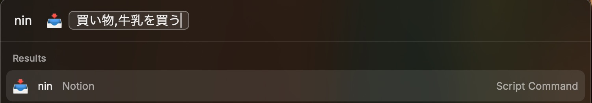
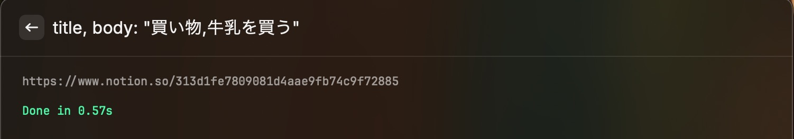

# nin

[](https://github.com/RAI015/nin/actions/workflows/ci.yml)

Raycast Script Command で Notion の INBOX データベースに 1 件追加する Python スクリプトです。

## 30秒で分かる

Raycast から `title` または `title, body` を入力するだけで、Notion の指定DBにページを追加します。外部ライブラリ不要、失敗時はHTTPエラー詳細を表示し、原因を切り分けしやすくしています。

## 実行例

入力（Raycast）:

```text
買い物, 牛乳を買う
```

出力（成功時）:

```text
https://www.notion.so/xxxxxxxxxxxxxxxxxxxxxxxxxxxxxxxx
```

## Demo

### Input example



### Success output



- Command: `nin`
- Runtime: Python 3.10+
- Dependency: 標準ライブラリのみ（外部ライブラリなし）

## できること

- `title`（必須）と `body`（任意）を受け取り、Notion のページを作成
- 成功時は作成ページ URL を標準出力に表示
- 失敗時は HTTP ステータスとレスポンスを標準エラーに表示

## ファイル構成

- `nin.py`: 本体
- `secrets.env.example`: 機密設定テンプレート（配布用）
- `secrets.env`: 実運用の機密設定（Git 管理外）

## セットアップ

1. `nin.py` を Script Commands ディレクトリに配置
2. 実行権限を付与

```bash
chmod +x nin.py
```

3. Raycast 設定で Script Directory を追加

- `Raycast Settings > Extensions > Script Commands`

4. 機密設定ファイルを作成

```bash
cp secrets.env.example secrets.env
```

5. `secrets.env` に実値を設定

```env
NOTION_TOKEN=ntn_xxx
NOTION_DATABASE_ID=xxxxxxxxxxxxxxxxxxxxxxxxxxxxxxxx
NOTION_TITLE_PROPERTY=タイトル
NOTION_VERSION=2022-06-28
NOTION_APPEND_BODY=1
```

6. Raycast から参照できるように環境変数を設定（1回）

```bash
launchctl setenv NOTION_ENV_FILE "/absolute/path/to/secrets.env"
```

7. Raycast 再起動

## 使い方

`fullOutput` モードで動作します。

1. Raycast で `nin` を選択
2. 引数に入力して実行

`title` だけでも実行できます（`body` は省略可）。

```text
title
title, body
```

## 環境変数

- `NOTION_TOKEN` (required)
- `NOTION_DATABASE_ID` (required)
- `NOTION_TITLE_PROPERTY` (optional, default: `タイトル`)
- `NOTION_VERSION` (optional, default: `2022-06-28`)
- `NOTION_APPEND_BODY` (optional, default: `1`)
- `NOTION_ENV_FILE` (optional, default: `~/.config/nin/secrets.env`)

優先順位は `環境変数 > secrets file > default` です。

## トラブルシュート

- `401/403`: Token 不正、または DB に Integration が共有されていない
- `404`: Database ID の取り違え
- `429`: レート制限
- `5xx`: Notion 側障害の可能性

ローカル切り分け例:

```bash
NOTION_ENV_FILE="/absolute/path/to/secrets.env" ./nin.py "nin title, body"
```

## セキュリティ注意点

- `secrets.env` は Git に含めない
- 共有は `secrets.env.example` のみ使う
- `NOTION_TOKEN` は最小権限の Integration を使う

## CI

GitHub Actions で以下を実行します。

- `python -m py_compile nin.py`
- `python -m unittest discover -s tests -p "test_*.py"`
- `ruff check nin.py`
- `gitleaks git .`
- `gitleaks dir . -c .gitleaks.toml`

## gitleaks

公開前の漏えいチェック:

```bash
gitleaks git .
gitleaks dir . -c .gitleaks.toml
```

- `git` はコミット履歴を検査
- `dir` は作業ツリーを検査
- `secrets.env` は `.gitleaks.toml` で除外済み

## ライセンス

MIT
